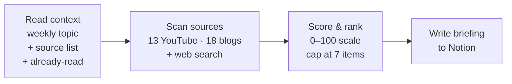

# Learning Partner Agent

A weekly AI learning curator I built for myself — and you can fork it for yours.

Every Sunday at 7pm, this agent scans 49 hand-picked sources, scores everything against the topic I'm studying that week, and writes 5–7 ranked recommendations into my Notion. The whole thing is a structured prompt. No code to maintain.

**Built for** designers, PMs, and anyone learning AI from a non-CS background who wants the signal without the scrolling. If you can edit a markdown file, you can adapt this for your own learning plan.

---

## What you get every Sunday

This is a real briefing the agent generated for **Week 7 — Context Engineering + RAG** on 3 May 2026. It arrives in my Notion every Sunday evening.

> **Generated:** 2026-05-03 | **Focus:** Context engineering + RAG
> **Sources checked:** YouTube (13 channels), Blogs/RSS (18 feeds), Web (5 searches)
> **Estimated total reading time:** ~2 hrs 27 min
>
> ### ⭐ Must Read
>
> **1. Everything You Need to Know About Context Engineering in 40 Minutes**
> Ravi Mehta (via Peter Yang) · YouTube · ~40 min · Score: 90/100
>
> **Summary:** Ravi Mehta presents a structured 3-layer system for context engineering: functional context (task instructions and examples), visual context (layout and format signals), and data context (retrieved information via RAG and memory). He shows how most failures in production AI aren't model problems — they're context design problems.
>
> **Why it matters for Week 7:** Context engineering is this week's named topic — and this video gives you a working framework before you've fully absorbed RAG and vector databases. Mehta's 3-layer model maps cleanly to design decisions you'll face when working on Copilot features.
>
> ---
>
> **2. Designing Stable Interfaces For Streaming Content**
> Joas Pambou · Smashing Magazine · ~19 min read · Score: 88/100
>
> **Summary:** Addresses three failure modes in AI streaming interfaces: scroll hijacking, layout shifts, and render degradation. Proposes concrete design-engineering principles including user-controlled scroll, incremental DOM updates, and batched rendering.
>
> **Why it matters for Week 7:** As you learn about RAG — which delivers context in real-time chunks — this teaches the UX layer that sits on top: how to design an interface that stays stable while AI is generating.
>
> ### 🟠 Recommended
>
> **3.** Red-Teaming a Network of Agents · Microsoft Research · ~15 min · Score: 85/100
> **4.** Why Cultivating Agency Matters More Than Skills · Lenny's Podcast · ~60 min · Score: 77/100
> **5.** Context Engineering · Simon Willison · ~3 min · Score: 76/100
>
> ### 🃏 Wild Card
>
> **6. The Web Trained AI to Deceive — Now Designers Have to Untrain It**
> UX Collective · ~10 min read · Score: 66/100
>
> Contrarian reframing: AI deception isn't a model problem — AI absorbed dark patterns from the web's training data. Designers are implicated in the problem and responsible for the fix.

That's the whole product. Everything else in this README is about how it works and how to make one for yourself.

---

## How it works



Five things make this work in practice — where most curation systems get noisy:

1. **Week-aware.** Reads my Notion checklist to detect which week of my 26-week plan I'm in. The agent already knows whether this week is "RAG" or "Multi-agent systems" without me telling it.
2. **Two scans, not one.** A *fresh* scan of the last 7 days via RSS, plus an *evergreen* scan of the best of the last 18 months via web search. A brilliant year-old post outranks a mediocre new tweet.
3. **Five-dimension scoring.** Quality dominates recency. Full table below.
4. **Hard-capped at 7 items.** The agent is forbidden from sending more, no matter how rich the candidate pool. Discipline is the feature.
5. **Dedup memory.** Tracks every URL it has ever recommended so I don't see the same post twice.

The agent's behaviour lives entirely in [`prompts/weekly-briefing.md`](https://github.com/Katherine-Peng/Learning-Agent/blob/main/prompts/weekly-briefing.md). It runs as a Claude Code scheduled task — no separate runtime, no servers, no deployment.

---

## The scoring system

Each candidate is scored 0–100 across five dimensions:

| Dimension | Weight | What it measures |
| --- | --- | --- |
| **Quality signal** | 0–35 | Six independent traits: falsifiable claims, original work, named systems, practitioner author, cross-domain reach, Tier 1 reference |
| **Topic relevance** | 0–25 | Match to *this week's* topic vs. general AI interest |
| **Content depth** | 0–20 | Framework-level thinking vs. hot takes |
| **Source trust** | 0–15 | Tier 1 (15) · Tier 2 (10) · newly discovered (5) |
| **Recency bonus** | 0–5 | Gentle tiebreaker — never enough to promote shallow content |

Items scoring **75+** become ⭐ **Must Read**. Items **50–74** become 🟠 **Recommended**. One 🃏 **Wild Card** slot is reserved for surprising content that wouldn't normally make the cut — contrarian takes, new voices, cross-domain links.

Full spec: [`config/scoring-algorithm.md`](https://github.com/Katherine-Peng/Learning-Agent/blob/main/config/scoring-algorithm.md)

---

## The 49 sources

| Category | Examples | Count |
| --- | --- | --- |
| Design × AI | Google PAIR, Microsoft HAX, Maggie Appleton, Vitaly Friedman | 8 |
| AI Engineering | Anthropic, Simon Willison, Karpathy, LangChain | 10 |
| Research | Stanford HAI, DeepMind, Microsoft Research | 5 |
| Product | Lenny's Podcast, Ethan Mollick, Peter Yang | 5 |
| Strategy | Dwarkesh Patel, Ben Thompson, No Priors | 4 |
| Safety & critique | Normal Tech, Robert Miles, Gary Marcus, Nathan Lambert | 5 |
| YouTube channels & engineering substacks | various | 12 |

Full list with feed URLs: [`config/sources.md`](https://github.com/Katherine-Peng/Learning-Agent/blob/main/config/sources.md)

---

## Make it your own

This repo is **pre-configured for my learning plan** — but the point is that you fork it and rewire it for yours. Three things to change:

**1. Your weekly topics.** Replace my 26-week plan in your Notion checklist. The agent reads whatever is in `Week N → Topic` and adapts. You don't touch the prompt for this — you change Notion and the agent picks it up.

**2. Your sources.** Edit [`config/sources.md`](https://github.com/Katherine-Peng/Learning-Agent/blob/main/config/sources.md) and the matching Notion Master Source Table. Designers might want more dribbble, Figma research, and UX writing feeds; PMs might want more growth, strategy, and case-study sources. Add what you actually read.

**3. Your scoring weights.** Edit [`config/scoring-algorithm.md`](https://github.com/Katherine-Peng/Learning-Agent/blob/main/config/scoring-algorithm.md) and the matching block in `prompts/weekly-briefing.md`. If you care less about "named systems" and more about "case studies with metrics," the weights are yours to tune.

The briefing format itself lives in Step 4 of `prompts/weekly-briefing.md`. Change emoji, sections, summary length — anything you want.

---

## Setup

**You'll need:**

- [Claude Code](https://docs.anthropic.com/en/docs/claude-code) installed
- A Notion workspace with two pages: a weekly checklist (so the agent knows which week you're in) and a parent page where briefings are written
- The Notion MCP connector enabled in Claude Code

**Two scheduled tasks run the agent:**

| Task | Schedule | Purpose |
| --- | --- | --- |
| `weekly-learning-briefing` | Sunday 7pm (`0 19 * * 0`) | Primary run |
| `weekly-learning-briefing-retry` | Sunday 9pm (`0 21 * * 0`) | Backup — checks for an existing run log first |

To install: paste the contents of `prompts/weekly-briefing.md` into a new scheduled task in Claude Code, set the cron to `0 19 * * 0`, and repeat for the retry. After any prompt change, push to both tasks via `update_scheduled_task`.

---

## Repo structure

```
Learning-Agent/
├── README.md                          ← you are here
├── prompts/
│   └── weekly-briefing.md             ← the agent's brain
├── config/
│   ├── sources.md                     ← 49 sources with feed URLs
│   ├── scoring-algorithm.md           ← full scoring spec
│   └── previously-recommended.md      ← dedup log (appended each run)
└── logs/
    └── run-YYYY-MM-DD.md              ← run logs with stats
```

Briefings are written directly to Notion, not stored locally.

---

Built by [Katherine Peng](https://www.katherinepeng.com). If you fork this and build your own, I'd love to see what you make.